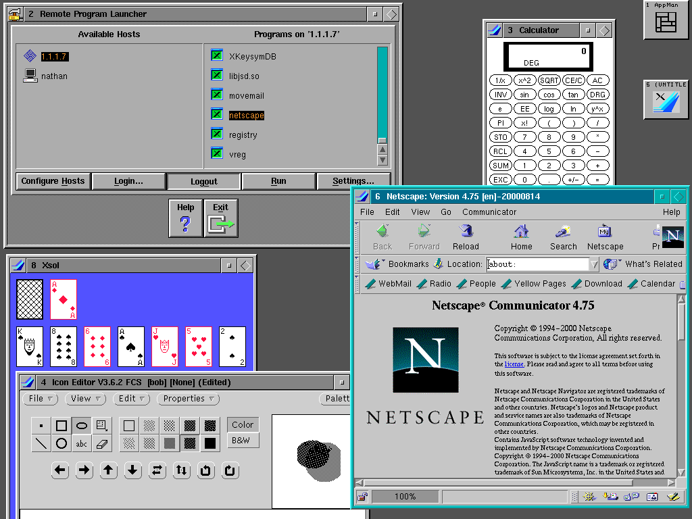

# Meanwhile in Unix Land

Over in the unix world, cooperative multitasking was avoided. UNIX had a different model: processes and signals.

You're probably familiar with processes. Take a look at your system's task manager or equivalent, and you'll see a GIANT list of processes --- all of them bigger than a Xerox Star.

|Cooperative Multitasking|Preemptive Multitasking|
|----------------------|----------------------|
|Programs run until they yield control.|The OS allocates time slices to each process.|
|**Fast**. Calls straight back into the OS.|**Slow**. Context switching requires saving and restoring state.|
|**Simple**. No need to manage time slices.|**Complex**. The OS must manage process states and scheduling.|
|**Dangerous**. A single misbehaving process can freeze the system.|**Robust**. One process can crash without affecting others.|

> So it's important to remember that even back in the 1980s, people were having "nerd fights" over which model was better!