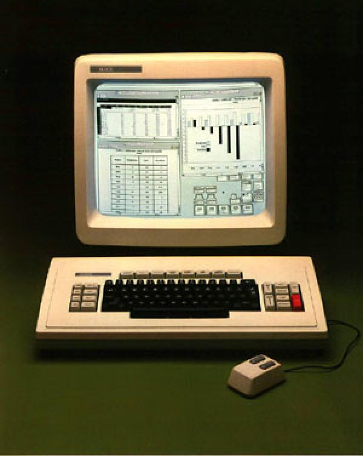
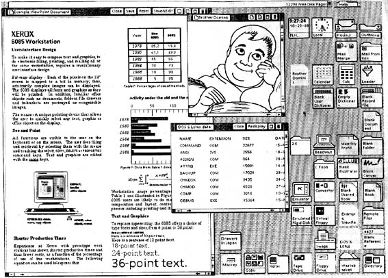

# A Brief History of Async

Async as a concept has been around for a *long* time.

## Xerox Star

In 1981, Xerox introduced the Xerox Star. It was one of the first commercial systems to use a graphical user interface (GUI).

| | |
|----------------------|----------------------|

With an AMD 2900 CPU (2 Mhz!), 386 KB of RAM (expandable to 1.5 Mb), an 8" floppy drive, and a 10 MB hard drive, the Xerox Star was a powerful machine for its time. 

It's now outpaced by my wristwatch.

The Xerox Star was one of the first *async* systems---cooperative multitasking. It supported both processes and **coroutines**. Here's an example of some Mesa (the language used by the Star) code that implements a coroutine:

```mesa
MODULE Example;

IMPORT Process;

VAR
    counter: INTEGER;

PROCEDURE CountUp;
BEGIN
    counter := 0;
    LOOP
        counter := counter + 1;
        Process.SUSPEND;   -- This is like yielding to another process
    END;
END CountUp;

PROCEDURE Run;
VAR
    p: Process.Process;
BEGIN
    p := Process.NEW(CountUp);
    Process.RESUME(p);      -- Start the coroutine
    Process.RESUME(p);      -- Resume execution after the yield
END Run;

END Example.
```

See `Process.SUSPEND`? That's just the same as `await` or `yield` in modern async programming!

> The Star isn't even the first async system. The concept of coroutines dates back to the 1950s, with languages like Simula and later languages like Lisp and Smalltalk implementing similar concepts.