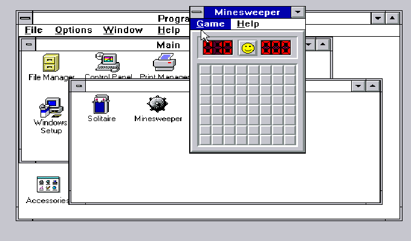
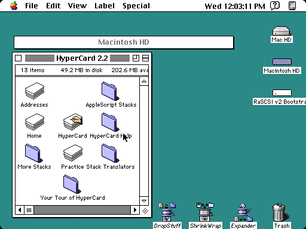

# A Brief History of Async (cont.)

Until the early 2000s (OS X was released in 2001), cooperative multitasking was the norm for desktop operating systems.

| Windows 3.1     |      Mac OS System 7 |
|----------------------|----------------------|
| | |

GUI programs in both Windows and Mac OS were single-threaded. They had evolved to pretty much follow the same model:

1. The program initializes and registers a callback for events.
2. The program returns control to the OS.
3. The OS calls the callback when an event occurs (like a mouse click, a timer, a keyboard event, etc.).
4. The program processes the event and returns control to the OS.

Long-running operations were handled by breaking them into smaller chunks and yielding control back to the OS. So even console mode programs had to remember to sleep:

```c
#include <windows.h>
#include <stdio.h>

void do_work()
{
    for (int i = 0; i < 10; i++)
    {
        printf("Working: %d\n", i);
        // Yield to other cooperative Win16 tasks
        Sleep(0);  // This lets the OS switch to another task
    }
}

int main()
{
    // In Win16, main is often WinMain, but this works for a simple console build
    printf("Starting work...\n");
    do_work();
    printf("Done.\n");
    return 0;
}
```

So what happened if you *didn't* yield control? The OS would just keep running your program until it finished. Everything else was **blocked**---and didn't update. Later versions of Windows and Mac OS had an interrupt running in the background that would kill an unresponsible program---and your system *might* even still work.

